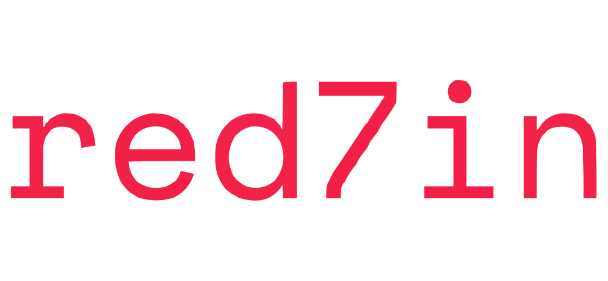

# Redvin

Official InterPlanetary Nostr Network (IPNN) implementation.
[Nostr](https://nostr.com/) as a Decentralized P2P Network.

## Supported NIP and IIPs

Check supported

- [NIPs (Nostr Improvement Proposals)](https://github.com/nostr-protocol/nips) : [HERE](./docs/NIPs.md)

- [IIPs (IPNN Improvement Proposals)](https://github.com/zurvan-lab/IPNN)  : [HERE](./docs/IIPs.md)

## Documents

You can find all documents on [docs](./docs/) folder.

## Contributing

Contributions to the Redvin are appreciated. Please read the [CONTRIBUTING](./CONTRIBUTING.md) guidelines before submitting a pull request or opening an issue.

## License

Redvin it under [GNU GENERAL PUBLIC LICENSE](./LICENSE).